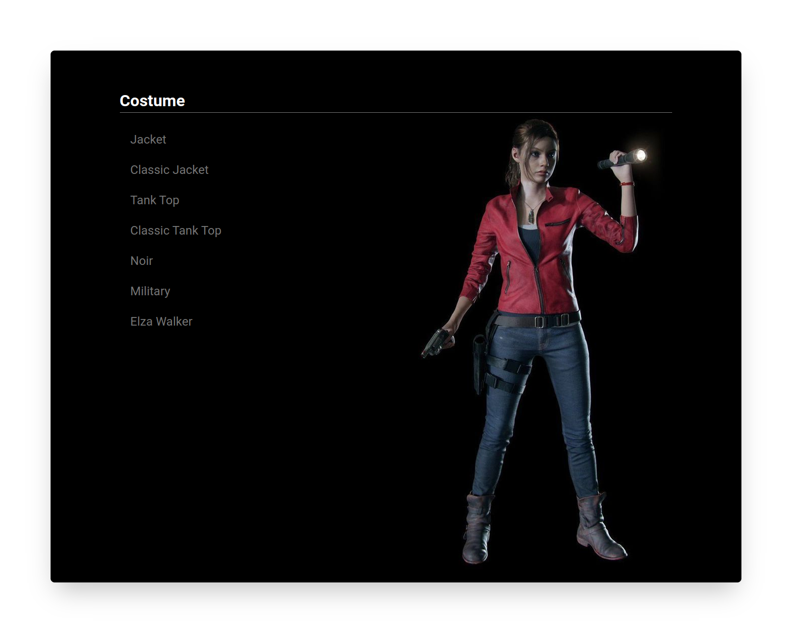

<p align="center">
  Simulating the Resident Evil Remake game options menu created using Next.js and Styled Components
</p>

## Tech

- [TypeScript](https://github.com/microsoft/TypeScript) - TypeScript is a superset of JavaScript that compiles to clean JavaScript output.
- [Next.js](https://nextjs.org/) - Next. js is a JavaScript framework created by Vercel. 
- [Styled Components](https://styled-components.com/) - ES6 and CSS to styled components.
- [Prettier](https://prettier.io/docs/en/cli.html) - An opinionated code formatter.
- [ESlint](https://eslint.org) - ESLint statically analyzes your code to quickly find problems.

This is a [Next.js](https://nextjs.org/) project bootstrapped with [`create-next-app`](https://github.com/vercel/next.js/tree/canary/packages/create-next-app).

## Getting Started

First, clone this repository:

```
git clone https://github.com/fariasmateuss/clean-juice.git
```

### Installing

Run to install the dependencies;

```
yarn
```

To start the project;

```
yarn next
```

Open [http://localhost:3000](http://localhost:3000) with your browser to see the result.


## Learn More

To learn more about Next.js, take a look at the following resources:

- [Next.js Documentation](https://nextjs.org/docs) - learn about Next.js features and API.
- [Learn Next.js](https://nextjs.org/learn) - an interactive Next.js tutorial.

You can check out [the Next.js GitHub repository](https://github.com/vercel/next.js/) - your feedback and contributions are welcome!

## Deploy on Vercel

The easiest way to deploy your Next.js app is to use the [Vercel Platform](https://vercel.com/import?utm_medium=default-template&filter=next.js&utm_source=create-next-app&utm_campaign=create-next-app-readme) from the creators of Next.js.

Check out our [Next.js deployment documentation](https://nextjs.org/docs/deployment) for more details.

## Feedback

You can check out [my profile on Linkedin](https://www.linkedin.com/in/fariasmateuss/) - your feedback and contributions are welcome!

# License

[MIT License](/LICENSE)
